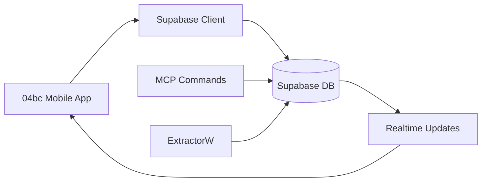

# 🗄️ Instrucciones de Base de Datos - App Móvil (04bc)

## 📊 Gestión de Base de Datos con Supabase MCP

**IMPORTANTE**: Para la app móvil 04bc, toda la gestión de base de datos se realiza exclusivamente a través de **Supabase** usando el **MCP (Model Context Protocol)**.

### 🎯 Reglas Específicas para App Móvil

1. **Supabase Client**: La app usa `@supabase/supabase-js` para operaciones normales
2. **MCP para Admin**: Usar MCP commands para tareas administrativas y debugging
3. **No SQL Directo**: Evitar conexiones SQL directas - usar MCP Supabase
4. **Sync con Backend**: Los datos se sincronizan con ExtractorW via Supabase

### 🔧 Comandos MCP Disponibles

```bash
# Verificar proyecto Supabase
mcp__supabase__get_project

# Listar tablas relevantes para la app móvil
mcp__supabase__list_tables

# Consultar datos específicos
mcp__supabase__execute_sql

# Aplicar migraciones cuando sea necesario
mcp__supabase__apply_migration
```

### 📱 Contexto de App Móvil

#### **Tablas Principales Usadas:**
- `auth.users` - Usuarios de la aplicación
- `profiles` - Perfiles de usuario
- `capturados` - Contenido capturado/guardado
- `trending_tweets` - Tendencias de Twitter
- `user_preferences` - Configuraciones de usuario

#### **Flujo de Datos:**


### 📋 Workflow para Desarrollo Móvil

#### 1. **Debugging de Datos**
```bash
# Verificar datos de usuario
mcp__supabase__execute_sql
# Query: SELECT * FROM profiles WHERE user_id = 'user-uuid'
```

#### 2. **Verificar Sincronización**
```bash
# Revisar últimos capturados
mcp__supabase__execute_sql
# Query: SELECT * FROM capturados ORDER BY created_at DESC LIMIT 20
```

#### 3. **Testing de Features**
```bash
# Verificar trending data
mcp__supabase__execute_sql
# Query: SELECT * FROM trending_tweets WHERE created_at > NOW() - INTERVAL '1 day'
```

### 🔄 Integración con Servicios Backend

#### **ExtractorW (API Backend)**
- Procesa datos y los almacena en Supabase
- La app móvil consume estos datos via Supabase client

#### **ExtractorT (Scraper)**
- Extrae datos de redes sociales
- Los almacena directamente en Supabase para consumo móvil

#### **NewsCron (Automation)**
- Procesa tendencias automáticamente
- Los datos aparecen en tiempo real en la app móvil

### 📝 Ejemplos de Uso Móvil

#### Verificar Usuario Activo
```sql
-- Usar: mcp__supabase__execute_sql
SELECT u.id, u.email, p.display_name, p.avatar_url
FROM auth.users u
LEFT JOIN profiles p ON u.id = p.user_id
WHERE u.last_sign_in_at > NOW() - INTERVAL '1 day';
```

#### Contenido Guardado por Usuario
```sql
-- Usar: mcp__supabase__execute_sql
SELECT * FROM capturados
WHERE user_id = 'user-uuid'
ORDER BY created_at DESC
LIMIT 50;
```

#### Trending para Feed Principal
```sql
-- Usar: mcp__supabase__execute_sql
SELECT * FROM trending_tweets
WHERE sentiment_score > 0
ORDER BY engagement_score DESC
LIMIT 30;
```

### 🔐 Configuraciones Específicas

#### **Supabase Client Config (TypeScript)**
```typescript
// src/lib/supabase.ts
import { createClient } from '@supabase/supabase-js'

const supabaseUrl = process.env.EXPO_PUBLIC_SUPABASE_URL!
const supabaseAnonKey = process.env.EXPO_PUBLIC_SUPABASE_ANON_KEY!

export const supabase = createClient(supabaseUrl, supabaseAnonKey)
```

#### **RLS Policies Relevantes**
- Usuarios solo ven su propio contenido guardado
- Trending data es público para todos
- Perfiles son visibles según configuración de privacidad

### 🚨 Recordatorios para App Móvil

1. **Real-time Updates**: La app recibe updates automáticos via Supabase subscriptions
2. **Offline Support**: Implementar cache local para mejor UX
3. **MCP para Debug**: Usar MCP commands para troubleshoot issues de datos
4. **Sync con Backend**: Los datos fluyen desde ExtractorW → Supabase → App
5. **Testing**: Verificar siempre la sincronización de datos en desarrollo

### 🎨 UI/UX Considerations

- **Loading States**: Mostrar loaders durante fetch de datos
- **Error Handling**: Manejar errores de conexión gracefully
- **Pull-to-Refresh**: Implementar para actualizar feeds
- **Infinite Scroll**: Para listas largas de contenido

---

**Nota**: Esta app móvil está diseñada para usuarios finales con interfaz user-friendly, a diferencia de ThePulse que es para periodistas profesionales.