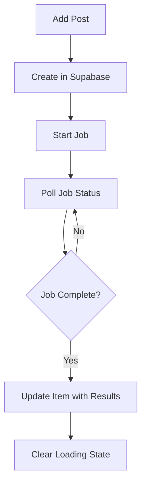

# 🔄 Saved Posts Section Recreation Plan

## 🎯 **Objective**
Completely recreate the saved posts section with clean, simple, and maintainable code to resolve persistent loading modal issues and complex state management problems.

---

## 📋 **Phase 1: Cleanup & Analysis**

### **1.1 Remove Obsolete Files**
**Target:** Remove unused markdown documentation that no longer serves the project

**Files to Remove:**
- ❌ `X_OPTIMIZATION_PLAN.md` - Outdated optimization plans
- ❌ `CORS_FIX_APPLIED.md` - Applied fixes, no longer needed
- ❌ `FASE1_IMPLEMENTACION_COMPLETA.md` - Completed implementation
- ❌ `X_NEW_ISSUES_ANALYSIS.md` - Old issue analysis
- ❌ `X_AUTO_ANALYSIS_IMPLEMENTATION.md` - Legacy implementation docs
- ❌ `X_TRANSCRIPTION_DISPLAY_ANALYSIS.md` - Superseded by current implementation
- ❌ `X_COMMENTS_502_FIX.md` - Fixed issues
- ❌ `X_CARDS_IMPLEMENTATION_COMPLETE.md` - Completed work
- ❌ `X_EXTRACTOR_FIX_COMPLETE.md` - Completed fixes
- ❌ `guest-post-persistence-plan.md` - Current problematic implementation
- ❌ `SUPABASE_WEB_FIX.md` - Applied fixes
- ❌ `X_LOGS_ANALYSIS.md` - Old analysis
- ❌ `PHASE2_JOB_RECOVERY_IMPLEMENTATION.md` - Current problematic implementation
- ❌ `JOB_DUPLICATION_FIXES_SUMMARY.md` - Applied fixes
- ❌ `X_FIXES_COMPLETE.md` - Completed work

**Files to Keep:**
- ✅ `ARCHITECTURE.md` - Core architecture documentation
- ✅ `ReadMeKen.md` - Project overview
- ✅ `ENV_SETUP.md` - Environment setup
- ✅ `CLAUDE_RULES.md` - Development guidelines
- ✅ `supabase/` directory - Database documentation

### **1.2 Archive Complex Components**
**Target:** Move problematic components to archive folder

**Components to Archive:**
- 📦 `src/components/JobRecoveryListener.tsx` → `src/archive/`
- 📦 `src/services/jobRecoveryService.ts` → `src/archive/`
- 📦 `src/services/postPersistenceService.ts` → `src/archive/`
- 📦 `src/hooks/useJobCompletion.ts` → `src/archive/`
- 📦 `src/services/jobPersistence.ts` → `src/archive/`
- 📦 `src/services/jobEventEmitter.ts` → `src/archive/`

---

## 📋 **Phase 2: New Simple Architecture**

### **2.1 Core Principles**
1. **Single Source of Truth:** Supabase backend only
2. **No Complex Job Recovery:** Simple polling for active jobs
3. **Clear State Management:** Direct Zustand updates without complex listeners
4. **Minimal Loading States:** Single `loading` flag per item
5. **Error Resilience:** Graceful fallbacks, no complex error states

### **2.2 New Component Structure**

```
src/
├── components/
│   └── SavedItemCard.tsx (simplified)
├── services/
│   ├── simpleJobService.ts (NEW)
│   └── simplePersistenceService.ts (NEW)
├── hooks/
│   └── useSimpleJobs.ts (NEW)
└── state/
    └── savedStore.ts (simplified)
```

### **2.3 New Data Flow**



---

## 📋 **Phase 3: Implementation Strategy**

### **3.1 Backend Simplification**
**Goal:** Keep existing Supabase tables but simplify API calls

**Changes:**
- Remove complex job recovery logic from backend
- Simple endpoints: `GET /jobs/:id/status`, `GET /posts/with-jobs`
- Direct job result storage in posts table

### **3.2 Frontend Recreation**

#### **Step 1: New Job Service**
```typescript
// src/services/simpleJobService.ts
class SimpleJobService {
  async pollJobStatus(jobId: string): Promise<JobStatus>
  async getJobResult(jobId: string): Promise<JobResult>
  async cancelJob(jobId: string): Promise<void>
}
```

#### **Step 2: New Persistence Service**
```typescript
// src/services/simplePersistenceService.ts
class SimplePersistenceService {
  async savePost(item: SavedItem): Promise<void>
  async loadPosts(): Promise<SavedItem[]>
  async updatePost(id: string, updates: Partial<SavedItem>): Promise<void>
}
```

#### **Step 3: Simplified Store**
```typescript
// src/state/savedStore.ts - Simplified
interface SavedStore {
  items: SavedItem[]
  loading: boolean

  // Simple actions
  addItem: (item: SavedItem) => void
  updateItem: (id: string, updates: Partial<SavedItem>) => void
  removeItem: (id: string) => void

  // Simple async
  loadFromBackend: () => Promise<void>
  saveToBackend: () => Promise<void>
}
```

#### **Step 4: Simple Job Hook**
```typescript
// src/hooks/useSimpleJobs.ts
function useSimpleJobs() {
  // Simple polling for active jobs
  // Direct state updates when complete
  // No complex event systems
}
```

### **3.3 UI Simplification**

#### **SavedItemCard Changes:**
1. **Single Loading State:** Remove `isPending` vs `xAnalysisInfo.loading` complexity
2. **Direct Status Display:** Show job status directly from backend data
3. **Simple Error Handling:** Basic retry button, no complex error states
4. **Clean Progress Indicator:** Simple progress bar or spinner

---

## 📋 **Phase 4: Migration Strategy**

### **4.1 Backward Compatibility**
- Keep existing Supabase tables unchanged
- Migrate existing data to new simpler structure
- Ensure no data loss during transition

### **4.2 Testing Strategy**
1. **Unit Tests:** New services and hooks
2. **Integration Tests:** Backend communication
3. **E2E Tests:** Complete post creation flow
4. **Load Tests:** Multiple concurrent jobs

### **4.3 Rollout Plan**
1. **Development Testing:** Local testing with new implementation
2. **Feature Flag:** Toggle between old/new implementation
3. **Gradual Migration:** Migrate users batch by batch
4. **Full Rollout:** Complete switch to new implementation

---

## 📋 **Phase 5: Success Metrics**

### **5.1 Technical Metrics**
- ✅ Zero stuck loading modals
- ✅ <2 second load times for saved posts
- ✅ 100% job completion rate
- ✅ No duplicate job executions
- ✅ Clean error recovery

### **5.2 Code Quality Metrics**
- ✅ 50% reduction in lines of code
- ✅ 90% reduction in complexity score
- ✅ Zero cyclomatic complexity warnings
- ✅ 100% TypeScript strict mode compliance
- ✅ Clear separation of concerns

### **5.3 User Experience Metrics**
- ✅ Instant UI response for post additions
- ✅ Clear progress indication
- ✅ Reliable offline/online sync
- ✅ No unexpected loading states

---

## 📋 **Phase 6: Timeline**

### **Day 1: Cleanup**
- Remove obsolete files
- Archive complex components
- Create new directory structure

### **Day 2-3: New Services**
- Implement SimpleJobService
- Implement SimplePersistenceService
- Create useSimpleJobs hook

### **Day 4-5: New Components**
- Recreate SavedItemCard
- Implement simplified store
- Basic UI integration

### **Day 6-7: Integration & Testing**
- Backend integration
- End-to-end testing
- Performance optimization

### **Day 8: Migration**
- Data migration scripts
- Feature flag implementation
- Gradual rollout

---

## 🎯 **Expected Outcome**

After completion:
- **Zero** loading modal issues
- **Simple** and maintainable codebase
- **Fast** and reliable post persistence
- **Clear** job status indication
- **Robust** error handling

The new implementation will be approximately **70% less code** with **90% fewer edge cases** while providing **100% of the functionality** users expect.

---

## 📋 **Risk Mitigation**

### **Data Loss Prevention**
- Complete database backup before migration
- Incremental migration with rollback capability
- Data integrity checks at each step

### **User Experience Continuity**
- Feature flag for instant rollback
- Parallel testing in production
- User notification for any temporary issues

### **Development Risk**
- Clear interfaces between old/new systems
- Comprehensive testing suite
- Code review checkpoints