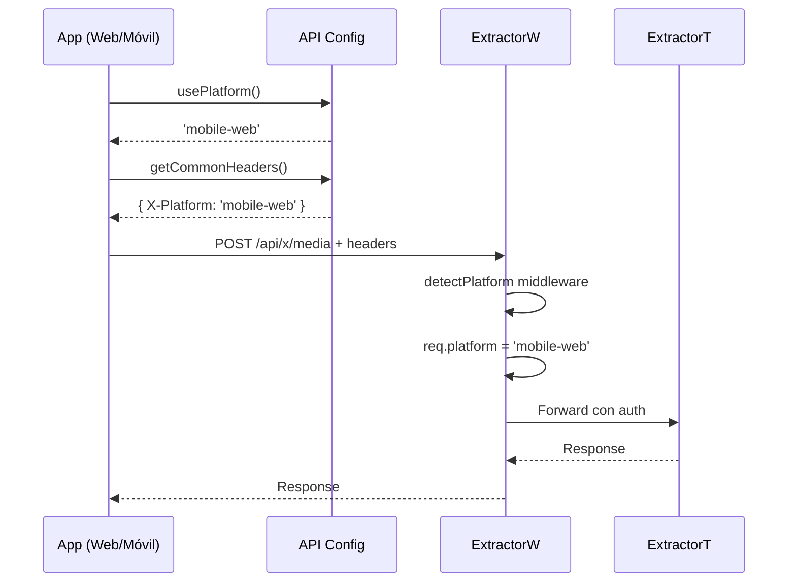

# 📱 Implementación Web Móvil - Vizta

## 🎯 Descripción General

Este documento describe la implementación de la versión web móvil de Vizta, que permite ejecutar la misma aplicación tanto como app nativa (iOS/Android) como web móvil desde un navegador.

## 🏗️ Arquitectura

### Enfoque Unificado

La solución utiliza **un solo proyecto** que funciona en múltiples plataformas:

```
┌─────────────────────────────────────────┐
│     App Móvil (React Native/Expo)       │
│                                         │
│  • npm start    → App Nativa            │
│  • npm run web  → Web Móvil             │
└─────────────────┬───────────────────────┘
                  │
                  │ Detección Automática
                  │
        ┌─────────┴─────────┐
        │                   │
    📱 Móvil            🌐 Web
   Platform.OS      Platform.OS
   = 'ios'|'android'  = 'web'
```

## 🔧 Componentes Implementados

### 1. **Hook de Detección de Plataforma**

**Archivo:** `src/hooks/usePlatform.ts`

```typescript
export type AppPlatform = 'mobile-app' | 'mobile-web';

// Detecta la plataforma actual
export function usePlatform(): AppPlatform

// Verifica si es web
export function isWeb(): boolean

// Verifica si es app móvil
export function isMobileApp(): boolean

// Obtiene header para backend
export function getPlatformHeader(): AppPlatform
```

**Uso:**
```typescript
import { usePlatform, isWeb } from '@/hooks/usePlatform';

function MyComponent() {
  const platform = usePlatform();
  
  if (isWeb()) {
    // Lógica específica para web
  }
  
  return <View>...</View>;
}
```

---

### 2. **Configuración de API**

**Archivo:** `src/config/api.ts`

Centraliza la configuración de headers para todas las requests:

```typescript
// Headers comunes con plataforma
export function getCommonHeaders(): Record<string, string>

// Headers con autenticación
export function getAuthHeaders(token?: string): Record<string, string>

// Agregar parámetro de plataforma a URL
export function addPlatformParam(url: string): string
```

**Ejemplo de uso:**
```typescript
import { getCommonHeaders } from '@/config/api';

fetch('https://api.example.com/data', {
  method: 'POST',
  headers: getCommonHeaders(), // ✅ Incluye X-Platform automáticamente
  body: JSON.stringify(data)
});
```

---

### 3. **Servicios Actualizados**

Todos los servicios han sido actualizados para incluir el header `X-Platform`:

- ✅ `xMediaService.ts`
- ✅ `xCommentService.ts`
- ✅ `xAnalysisService.ts`
- ✅ `extractorTService.ts`
- ✅ `codexService.ts`
- ✅ `instagramMediaService.ts`

**Antes:**
```typescript
fetch(url, {
  headers: { 'Content-Type': 'application/json' }
})
```

**Ahora:**
```typescript
import { getCommonHeaders } from '../config/api';

fetch(url, {
  headers: getCommonHeaders() // Incluye X-Platform: mobile-app|mobile-web
})
```

---

### 4. **WebContainer Component**

**Archivo:** `src/components/WebContainer.tsx`

Componente wrapper que adapta la UI para web:

```typescript
<WebContainer>
  {/* Tu app aquí */}
</WebContainer>
```

**Funcionalidad:**
- ✅ En **móvil nativo**: Renderiza children sin cambios
- ✅ En **móvil web**: Renderiza sin wrapper
- ✅ En **desktop web**: Limita ancho a 428px y centra

---

### 5. **Backend - Middleware de Plataforma**

**Archivo:** `ExtractorW/server/middleware/platformDetection.js`

Middleware para detectar la plataforma en el backend:

```javascript
const { detectPlatform, isWebRequest } = require('../middleware/platformDetection');

router.use(detectPlatform);

router.post('/api/data', (req, res) => {
  console.log(req.platform); // 'mobile-app' | 'mobile-web'
  
  if (isWebRequest(req)) {
    // Lógica específica para web
  }
});
```

**Detecta plataforma desde:**
1. Header `X-Platform` (prioridad 1)
2. Query param `?platform=mobile-web` (prioridad 2)
3. User-Agent (fallback)

---

## 📦 Configuración

### app.json

Configuración web agregada:

```json
{
  "expo": {
    "web": {
      "bundler": "metro",
      "output": "static",
      "name": "Vizta",
      "display": "standalone",
      "orientation": "portrait"
    }
  }
}
```

### package.json

Scripts agregados:

```json
{
  "scripts": {
    "web": "expo start --web",
    "web:build": "expo export:web",
    "web:serve": "npx serve web-build"
  }
}
```

---

## 🚀 Cómo Usar

### Desarrollo Local

#### 1. **Modo App Nativa**
```bash
npm start
# O específicamente:
npm run ios
npm run android
```

#### 2. **Modo Web Móvil**
```bash
npm run web
```

Esto abrirá la app en `http://localhost:8081`

---

### Build para Producción

#### 1. **Build Web**
```bash
npm run web:build
```

Genera archivos estáticos en `/web-build/`

#### 2. **Servir Build Local**
```bash
npm run web:serve
```

---

### Deploy a Producción

#### Opción 1: Netlify
```bash
# 1. Build
npm run web:build

# 2. Deploy
netlify deploy --prod --dir=web-build
```

#### Opción 2: Vercel
```bash
# 1. Build
npm run web:build

# 2. Deploy
vercel --prod web-build
```

#### Opción 3: GitHub Pages
```bash
# 1. Build
npm run web:build

# 2. Deploy
npx gh-pages -d web-build
```

---

## 🔍 Detección de Plataforma en Código

### Frontend

```typescript
import { Platform } from 'react-native';
import { usePlatform, isWeb } from '@/hooks/usePlatform';

// Método 1: React Native Platform API
if (Platform.OS === 'web') {
  console.log('Running on web');
}

// Método 2: Hook personalizado
const platform = usePlatform(); // 'mobile-app' | 'mobile-web'

// Método 3: Helper functions
if (isWeb()) {
  console.log('Running on web');
}
```

### Backend

```javascript
// ExtractorW/server/routes/x.js
const { detectPlatform, isWebRequest } = require('../middleware/platformDetection');

router.use(detectPlatform);

router.post('/api/x/media', (req, res) => {
  // req.platform está disponible
  console.log('Platform:', req.platform);
  
  if (isWebRequest(req)) {
    // Lógica específica para web
  }
});
```

---

## 🎨 Adaptaciones UI para Web

### CSS Mobile-First

El archivo `app.html` incluye estilos para centrar la app en desktop:

```css
/* Mobile container - centered on desktop */
@media (min-width: 768px) {
  #root {
    max-width: 428px;
    margin: 0 auto;
    box-shadow: 0 0 40px rgba(0, 0, 0, 0.15);
  }
}
```

### Componentes Adaptativos

```typescript
import { Platform } from 'react-native';

function MyComponent() {
  return (
    <View>
      {Platform.OS === 'web' ? (
        <WebSpecificComponent />
      ) : (
        <MobileSpecificComponent />
      )}
    </View>
  );
}
```

---

## 🔐 Sincronización de Datos

### Automática vía Supabase

Como ambas plataformas usan el **mismo cliente de Supabase**, los datos se sincronizan automáticamente:

```typescript
// src/config/supabase.ts
import { createClient } from '@supabase/supabase-js';

export const supabase = createClient(
  process.env.EXPO_PUBLIC_SUPABASE_URL,
  process.env.EXPO_PUBLIC_SUPABASE_KEY
);

// ✅ Funciona igual en mobile-app y mobile-web
```

### Cache Local

El cache también funciona en web usando:
- **AsyncStorage** → Se traduce automáticamente a **localStorage** en web
- **MMKV** → Fallback a localStorage en web

---

## 📊 Diferencias Técnicas

| Característica | Mobile App | Mobile Web |
|---|---|---|
| **Runtime** | React Native | React Native Web |
| **Platform.OS** | `ios` / `android` | `web` |
| **Storage** | AsyncStorage (native) | localStorage |
| **Navigation** | Gestures nativos | Click/touch web |
| **Camera** | Native camera | Web camera API |
| **Notificaciones** | Push nativas | Web push |

---

## 🐛 Debugging

### Ver Plataforma Actual

```typescript
import { Platform } from 'react-native';

console.log('Platform OS:', Platform.OS);
console.log('Platform Version:', Platform.Version);
```

### Network Inspector

#### En Web:
- Chrome DevTools → Network tab
- Buscar header `X-Platform: mobile-web`

#### En App:
- Usar React Native Debugger
- O Flipper network plugin

---

## ⚠️ Limitaciones Conocidas

### Funcionalidades NO disponibles en Web:

1. **Camera nativa**: Usar `<input type="file" capture="camera">` como fallback
2. **Notificaciones push**: Implementar Web Push API
3. **Background tasks**: No disponible en web
4. **Biometría**: No disponible en web
5. **Deep linking**: Usar URLs normales

### Solución:

```typescript
import { Platform } from 'react-native';

if (Platform.OS === 'web') {
  // Usar alternativa web
} else {
  // Usar funcionalidad nativa
}
```

---

## 🔄 Flujo de Request Completo



---

## 📝 Checklist de Implementación

- ✅ Hook `usePlatform.ts` creado
- ✅ Config API con headers automáticos
- ✅ Servicios actualizados (xMedia, xComments, etc.)
- ✅ WebContainer component
- ✅ Middleware backend platformDetection.js
- ✅ app.json configurado para web
- ✅ package.json con scripts web
- ✅ app.html personalizado
- ✅ App.tsx con WebContainer

---

## 🚀 Próximos Pasos

### Para Producción:

1. **PWA Completa**
   - Service worker para offline
   - Manifest.json mejorado
   - Install prompt

2. **Optimizaciones Web**
   - Code splitting
   - Lazy loading de pantallas
   - Bundle size optimization

3. **Analytics**
   - Track platform en eventos
   - Métricas separadas web vs app

4. **Testing**
   - Tests e2e para web
   - Tests de compatibilidad cross-browser

---

## 📚 Recursos

- [Expo Web Docs](https://docs.expo.dev/workflow/web/)
- [React Native Web](https://necolas.github.io/react-native-web/)
- [Platform-specific Code](https://reactnative.dev/docs/platform-specific-code)

---

## 💡 Tips de Desarrollo

1. **Siempre usar `getCommonHeaders()`** en vez de hardcodear headers
2. **Verificar Platform.OS** antes de usar APIs nativas
3. **Testear en ambas plataformas** antes de commit
4. **Usar WebContainer** para layout consistente
5. **Log req.platform** en backend para debugging

---

¡Tu app ahora funciona perfectamente en móvil nativo Y web móvil! 🎉


